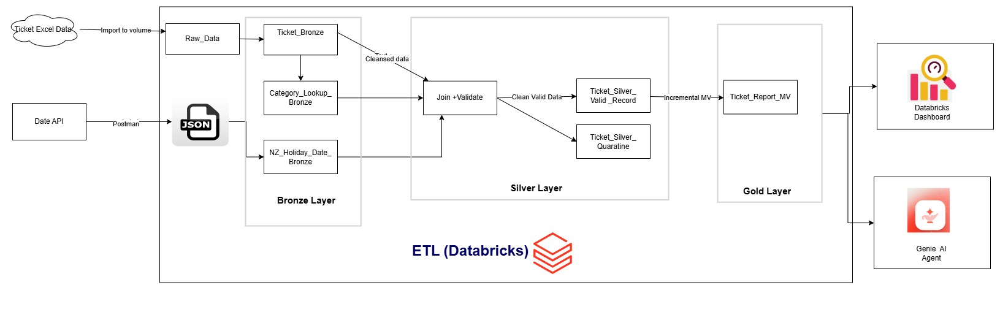

# TechSolve IT — Ticket Data Analytics & AI Agent

End-to-end data pipeline, dashboard, and natural-language AI agent built on **Databricks**, developed as part of a Data & AI Specialist practical assessment. The project ingests TechSolve's support ticket export, enriches it with an external New Zealand public holiday dataset, cleans and standardises it through a medallion (bronze → silver → gold) architecture, and surfaces the results through a dashboard and an AI-powered natural-language agent.

> **Note:** All data used in this project is synthetic. No real customer or business data is included.

---

## Table of Contents

1. [Project Overview](#project-overview)
2. [Architecture](#architecture)
3. [Tech Stack](#tech-stack)
4. [Data Sources](#data-sources)
5. [Pipeline Walkthrough](#pipeline-walkthrough)
   - [1. External Enrichment Data: Public Holiday API Ingestion (Bronze Layer)](#1-external-enrichment-data-public-holiday-api-ingestion-bronze-layer)
   - [2. Reference Data: Standardising Ticket Categories (Bronze Layer)](#2-reference-data-standardising-ticket-categories-bronze-layer)
   - [3. Bronze Layer: Raw Ticket Data Ingestion](#3-bronze-layer-raw-ticket-data-ingestion)
   - [4. Silver Layer: Data Cleaning, Enrichment & Validation](#4-silver-layer-data-cleaning-enrichment--validation)
   - [5. Gold Layer: Aggregated Reporting View](#5-gold-layer-aggregated-reporting-view)
   - [6. Orchestration: End-to-End Pipeline Automation](#6-orchestration-end-to-end-pipeline-automation)
6. [Dashboard](#dashboard)
7. [AI Agent](#ai-agent)
8. [Repository Structure](#repository-structure)
9. [What I Would Do Differently](#what-i-would-do-differently)
10. [Challenges](#challenges)
11. [AI Tool Usage Disclosure](#ai-tool-usage-disclosure)

---

## Project Overview

TechSolve IT is a fictional managed service provider. This project answers a simple operational question: **what types of support issues are being raised, how are they being handled, and where is there room to improve?**

The solution covers three parts:

| Part | Deliverable |
|------|-------------|
| 1 | Source, combine, and clean ticket data + an external dataset |
| 2 | A dashboard reporting on ticket issues, status, and resolution time |
| 3 | An AI agent that can answer natural-language questions about the data |

---

## Architecture

The pipeline follows a standard **medallion architecture** (bronze → silver → gold), which keeps ingestion, cleaning, and enrichment separated, auditable, and independently re-runnable.


*Figure 1: Databricks Job pipeline — Holiday/Category lookup → Bronze → Silver → Gold → Dashboard*


*Figure 2: Successful end-to-end job run (~10 minutes total duration)*

> Screenshots are stored in `docs/images/` — see [Repository Structure](#repository-structure).

---

## Tech Stack

| Tool | Purpose | Why chosen |
|------|---------|------------|
| **Databricks (Lakehouse Platform)** | Ingestion, transformation, orchestration | One platform for compute, storage, orchestration, and governance — no data movement or glue code between separate systems |
| **Delta Lake** | Storage format for all bronze/silver/gold tables | ACID transactions, schema enforcement, native support for materialized views |
| **Databricks Auto Loader** | Incremental file ingestion | Tracks already-processed files, avoids duplicate ingestion, and is stream-ready for future incremental ticket data |
| **SQL & PySpark** | Transformation logic | SQL for set-based joins/aggregations/validation; Python for procedural tasks like the API call and Excel-to-CSV conversion |
| **Databricks Jobs** | Orchestration | Chains all pipeline stages into a single, repeatable, end-to-end run |
| **Databricks AI/BI Dashboard** | Visualisation (Part 2) | Reads directly from the gold-layer materialized view with no export/refresh step |
| **Genie (Databricks AI/BI)** | Natural-language AI agent (Part 3) | Native to Databricks; queries gold-layer tables directly without a separate AI service or auth layer |

---

## Data Sources

| Dataset | Source | Reason for inclusion |
|---------|--------|----------------------|
| **TechSolve Ticket Data** | Provided as part of this assessment (Excel export) | Core dataset — raw support ticket records |
| **NZ Public Holidays (1990–2030)** | [Nager.Date Public Holiday API](https://date.nager.at/Api) | Free, no API key required, returns clean structured JSON. Used to test whether ticket volume/type is affected by public holidays (e.g. spikes before a long weekend, dips during holiday periods) |

---

## Pipeline Walkthrough

### 1. External Enrichment Data: Public Holiday API Ingestion (Bronze Layer)

NZ public holiday data for 1990–2030 was pulled from the Nager.Date API and the raw JSON response saved into a bronze volume. From this raw response, only the fields needed for reporting were extracted — `date`, `name` (holiday name), and `global` (a flag, provided natively by the API, indicating whether a holiday is observed nationwide or only regionally). Records were de-duplicated by date and loaded into a dedicated `holiday_lookup` Delta table.

This was kept as a fully separate, standalone step from the ticket data, since it comes from an external source with its own refresh cycle.

**Notebook:** [Lookup_tables.ipynb](notebooks/Lookup_tables.ipynb)

### 2. Reference Data: Standardising Ticket Categories (Bronze Layer)

A `category_lookup` table was built by hand, mapping the many inconsistent raw ticket category values (e.g. `BUG`, `Bug Report`, `bug_report`) into a single standardised `cleaned_category` and `cleaned_sub_category`. Splitting this into two levels allows reporting to either roll up to a small number of high-level categories for an executive view, or drill into sub-categories for operational detail.

**Notebook:** [Lookup_tables.ipynb](notebooks/Lookup_tables.ipynb)

### 3. Bronze Layer: Raw Ticket Data Ingestion

The provided Excel ticket export was converted to CSV via a small Python/pandas script, kept as an exact, untransformed copy of the source data (no cleaning or renaming at this stage). It was then ingested into a Delta table (`techsolve.ticket_bronze.ticket_bronze`) using **Databricks Auto Loader**.

Auto Loader was chosen specifically because it tracks which files have already been processed, so re-running the pipeline never re-ingests or duplicates a file already loaded — it only picks up new files landing in the input path. This also means the same pipeline is ready to handle ticket data arriving as a continuous stream in future, rather than only as a one-off batch export.

**Notebook:** [Bronze_Load.ipynb](notebooks/Bronze_Load.ipynb)

### 4. Silver Layer: Data Cleaning, Enrichment & Validation

The bronze ticket table was cleaned (nulls handled via sensible defaults, e.g. `N/A` or `Unassigned` depending on the field) and joined against both bronze-layer lookup tables:
- **Holiday lookup** — on ticket creation date, attaching holiday name and the `global` flag.
- **Category lookup** — on raw category, attaching `cleaned_category` and `cleaned_sub_category`.

A set of data-quality validation rules was also applied, and the output was deliberately split into **two separate tables** rather than silently filtering bad records out:

1. **Ticket Silver table** (`ticket_silver`): records that pass all validation checks — a valid (non-null) ticket ID, a ticket creation year and resolution year both falling within the expected range (1990–2026), and a resolution date not earlier than the creation date.
2. **Quarantine table** (`ticket_silver_quarantine`): records that fail one or more of these checks, tagged with a reason column stating exactly why. Three situations are captured:
   1. Creation date falls outside the 1990–2026 range — likely a data entry error or corrupted date field upstream.
   2. Resolution date falls outside the 1990–2026 range — same likely cause.
   3. Resolution date earlier than creation date — logically impossible, almost always a source system or export error.

**Why split rather than drop invalid records?**

1. **Visibility** — silently discarding records hides data-quality issues from downstream users; an operations manager would have no way of knowing records were excluded, or why. A dedicated quarantine table keeps these issues visible and auditable.
2. **Recoverability** — many flagged records aren't necessarily unusable, just mistyped or affected by an export glitch. Keeping them in their own table allows the support or data team to review, correct, and re-submit them through the bronze layer, rather than losing them permanently.

**Notebook:** [silver_Load.ipynb](notebooks/silver_Load.ipynb)

### 5. Gold Layer: Aggregated Reporting View

From the clean silver table, `gold_ticket_summary` was built as a **materialized view** rather than a plain table, chosen for three reasons:

- **Automatic freshness** — incrementally refreshes whenever the underlying silver table changes, with no manual rebuild step or separate scheduled job.
- **Query performance** — results are pre-computed, so downstream tools (dashboard, AI agent) get table-like query speed while always reflecting the latest silver data.
- **Simplicity** — removes the need for extra orchestration logic to manage refresh timing, since Databricks handles incremental recomputation itself.

The view reports ticket counts by `cleaned_category`, `cleaned_sub_category`, and day, alongside a `tickets_on_holiday` measure.

**Table:** `techsolve.ticket_gold.gold_ticket_summary`

### 6. Orchestration: End-to-End Pipeline Automation

All stages above are wired into a single Databricks Job — **`TechSolve_Ticket_job_project`** — with five sequential tasks:

1. `Holiday_API_and_Category_lookup`
2. `Bronze_Ticket`
3. `Silver_Ticket`
4. `Gold_Ticket_category_summary`
5. `Ticket_Summary_Dashboard`

The full pipeline runs end-to-end on a single trigger. A complete run currently takes around **10 minutes** (see Figures 1 and 2 above).

---

## Dashboard

Built on **Databricks AI/BI Dashboard**, reading directly from `gold_ticket_summary`. Reports on:
- Ticket volume and issue type breakdown (category / sub-category)
- Ticket status and resolution time trends (2024–2025)
- Ticket volume in relation to NZ public holidays


*Figure 3: TechSolve ticket summary dashboard*

## AI Agent

Built using **Genie (Databricks AI/BI Genie)**, connected directly to the gold-layer tables. It can answer natural-language operational questions such as ticket trends, team performance, and problem areas, without a separate AI service, custom API integration, or additional authentication layer.


*Figure 4: Genie natural-language agent answering an operational question*

---

## Repository Structure

```
.
├── README.md
├── notebooks/
│   ├── Lookup_tables.ipynb        # External holiday API + category lookup (bronze)
│   ├── Bronze_Load.ipynb          # Excel → CSV → Delta (Auto Loader)
│   └── silver_Load.ipynb          # Cleaning, joins, validation, quarantine
├── docs/
│   ├── images/
│   │   ├── job_pipeline.png
│   │   ├── job_runs.png
│   │   ├── dashboard.png
│   │   └── genie_agent.png
│   └── review.pdf                 # Full written review (LaTeX-generated)
└── data/
    └── TechSolve_Ticket_Data.xlsx # Source dataset (synthetic)
```

---

## What I Would Do Differently

1. **Data governance for sensitive fields** — apply column-level governance (e.g. masking or restricted access via Unity Catalog) to fields like customer email, billing contact email, and customer name.
2. **Column-level data quality testing** — extend validation beyond dates/IDs to systematic checks across every column (value ranges, valid category membership, completeness).
3. **SCD Type 2 handling** — preserve historical changes to fields like `account_manager` or `customer_segment`, so a ticket can be tied to who was responsible *at the time it was raised*, not just the current value.

## Challenges

The most challenging issue arose while building the Auto Loader ingestion pipeline. Excel files were initially converted directly to **Parquet**, and the first file ingested established the schema for the target table. When a later file arrived with nulls in a column that had previously contained non-null values, the Excel-to-Parquet conversion inferred a different data type for that column. Since Parquet embeds schema information within each file, Auto Loader detected a schema mismatch and ingestion failed.

**Fix:** switched the intermediate format from Parquet to **CSV**. CSV doesn't embed data types — only raw text — so Auto Loader instead inferred the schema consistently from the data itself at ingestion time, resolving the mismatch and allowing the pipeline to run reliably even as new, imperfect files arrived.

## AI Tool Usage Disclosure

AI (Claude) was used in a limited, supporting capacity — mainly as a research aid to explore Databricks concepts such as Auto Loader and materialized view refresh behaviour, to sanity-check SQL/PySpark syntax, and to help structure and phrase the written review. The pipeline design, data modelling decisions, debugging, and implementation were carried out directly in Databricks.
